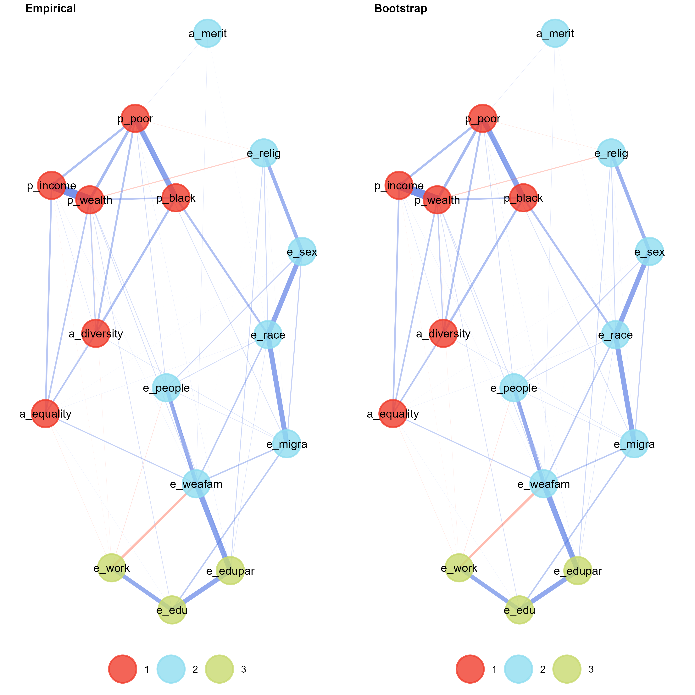
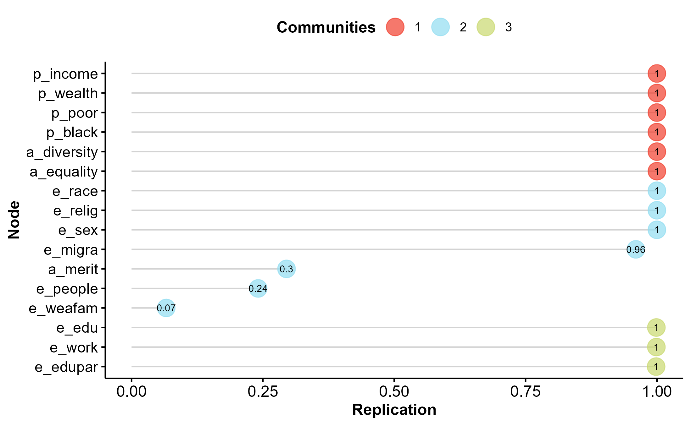
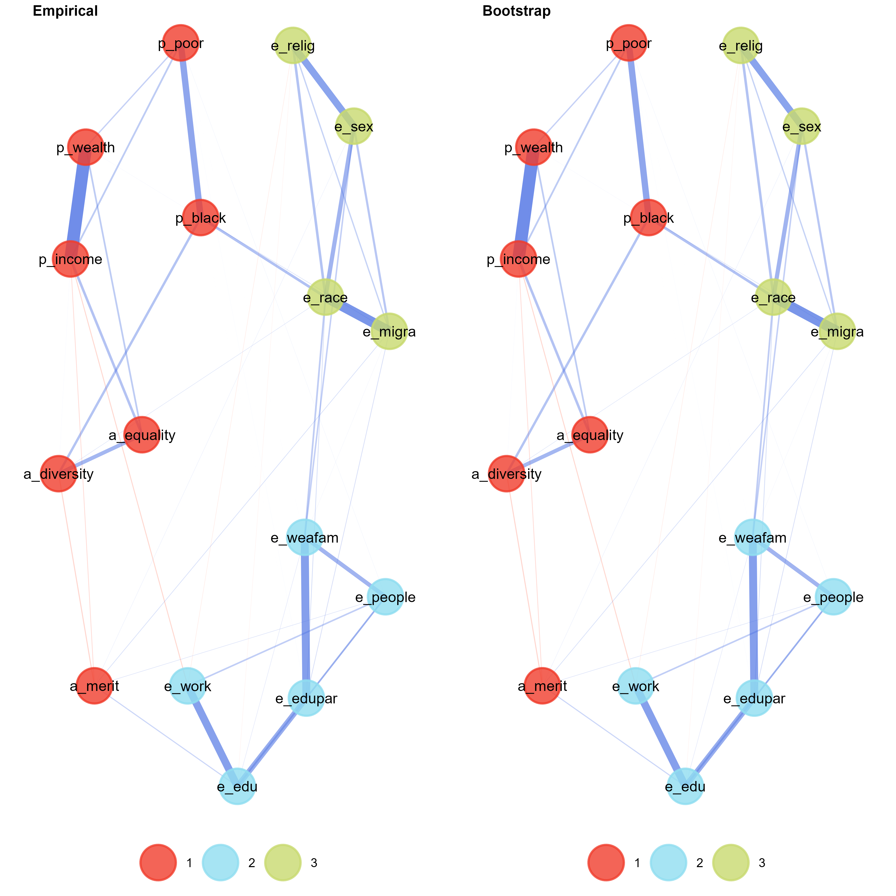
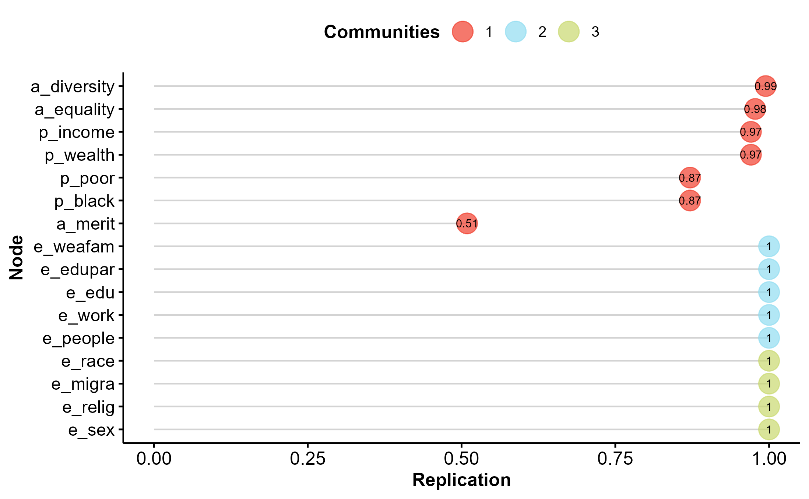
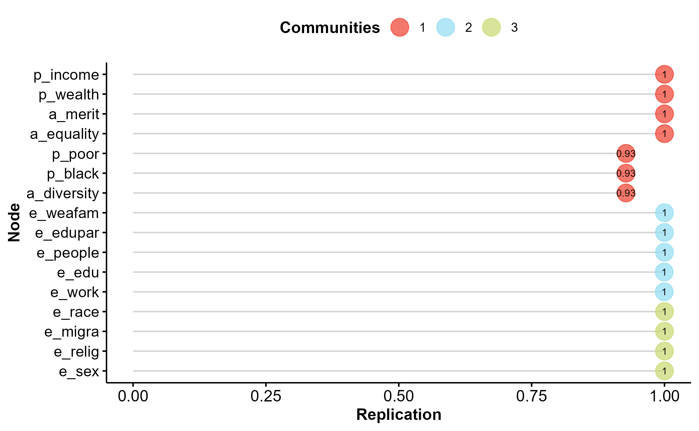
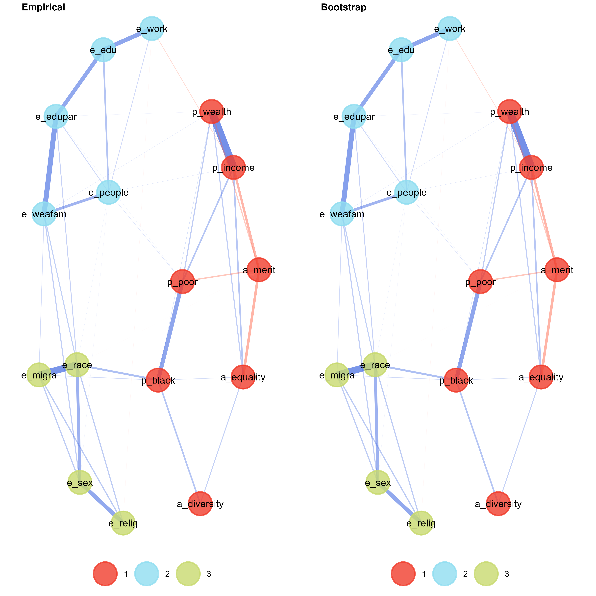
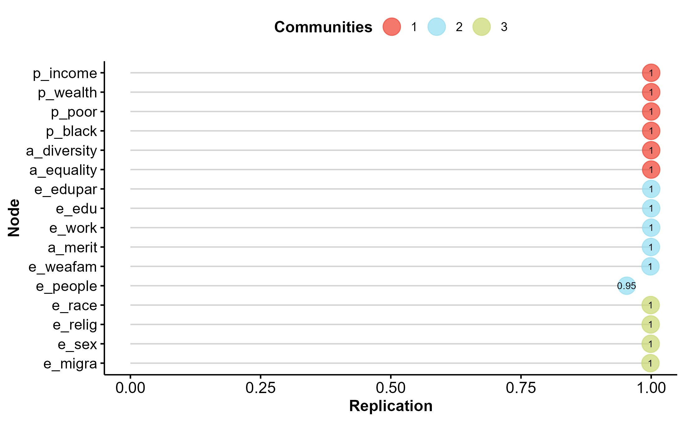

<style>
body {
text-align: justify}
</style>

```{r Setup, message=FALSE, warning=FALSE, include=FALSE}
knitr::opts_chunk$set(
	message = FALSE,
	warning = FALSE,
	echo = FALSE,
	fig.align="center",
	out.width='\\textwidth'
	)
```

```{r}
#remotes::install_github("gorkang/html2latex")
library(pacman)
p_load(tinytex, tidyverse, stargazer, here, haven, kableExtra, 
       summarytools, sjPlot, sjtable2df, parameters, html2latex)
```

```{r}
#Load database
load(here("Output", "databases.RData"))
load(here("Output", "alphas.RData"))
```

In this file we report additional analyses for the paper "Inequality belief systems: what they look like, how
to study them, and why they matter". We report a list of tables and figures at the beginning of the file, and we plot them in order at the end of this summary. 

# Table of contents
* **Descriptives:** The master table shows the label and the survey question of each attitude reported in the analyses. Table 2 and Table 3 show the descriptives of these items in US and NL respectively. High values always indicate endorsement of each attitude. Table 4 and Table 5 show the descriptives of the sociodemographic control variables in US and NL respectively.

* **Cronbach's alpha:** Table 6 reports the reliability of the indexes views, factors and identites, adopted in the regression models of Section 4.4 (Table 2: Linear regression models on support for redistribution - US; Table 3: Linear regression models on support for redistribution - NL). Indexes views and identities are reliable across countries. Index factors display low alphas instead. This is not surprising, as this indexes feature the node a_merit. As described in the article, this node produce several changes between belief system of the NL and US population. Therefore, these low scores underline that full sample analysis might be misleading if not taking into account the structural heterogeneity of survey samples. We decided to work with these variables, despite their low reliability, as indexes were computed only to reduce data to fit the regression models of Section 4.4, which needed to account for the content of people's belief systems.  

* **Linear regression models on attitude toward redistribution:** Table 7 and Table 8 report the full set of coefficients of the linear regression models for attitude toward redistribution, presented in an abbreviated form in Section 4.4 (Table 2: Linear regression models on support for redistribution - US; Table 3: Linear regression models on support for redistribution - NL).

* **Robustness of EGA:** To detect the robustness of EGA results we adopt parametric bootstrap technique. For each network shown in the article, we reseample with replacement 2000 bootstrapped samples. Then, we re-estimate EGA on each of the 2000 bootstrapped samples. This allow us to compare the results of the EGA fitted on the original sample with the average results of obtained in the bootstrapped samples. Moreover, we are also able to estimate the stability of the community detection algorithm, by examining the extent to which each empirically derived dimension is exactly recovered from the replicate bootstrap samples. In the article we estimated six network structures: one for each CCA cluster (two in US, two in NL) and one for each country. For each of these six network we report two figures. First, we compare the network structures retrieved in the original samples with the average structures obtained by aggregating the results of the bootstrapped samples. Effectively, this results in a figure comparing the original networks shown in the article and the average network obtained in the bootstrapped samples. Moreover, we report a plot showing how often the membership of each variable is replicating across bootstraps. Regarding this plot, item scores greater than 0.70 reflect sufficient stability [(Christensen & Golino, 2021)](https://www.mdpi.com/2624-8611/3/3/32). 
Results are shown in Figures 1 to Figures 12. Overall, the sample and bootstrapped EGAs are always similar, and community detection results are robust and overcome the bootstrap robustness tests. The only exceptions to these patterns are the nodes e_people, and e_weafam in the US2 network, and the node a_merit in the US1 and US2 networks. These nodes change their community membership across bootstrapped samples. However, the results regarding the number of communities of US1 EGA is highly stable. Indeed, 1946 of the 2000 bootstrapped samples displayed 3 clusters; only 1 bootstrapped sample displayed 2 clusters, and only 53 samples produced 4 communities. Moreover, the edges of the sample and bootstrapped networks do not differ meaningfully. This entails that the instability of this network is due to the community membership of some of its node, and not to its edges. Since our analyses of the four belief system mainly focused on the latter, and utilized nodes' community membership as a descriptive tool, we are not concerned with this kind of instability. Instability at the community membership level would be a concern only for the full sample networks. Indeed, these communities dictated the formation of the indexes for the regressions of Section 4.4. However, these results are remarkably stable (item stability always higher than .74 in NL, and higher than .96 in US). 

* **Descriptives on network centrality:** We compute Strength centrality to describe nodes' importance in the four inequality belief system. This measure is a refined version of Degree centrality suited to the study of weighted networks. For each node, it is calculated by summing the absolute weights of all the edges connected to that node [(Opshal, 2010)](https://www.sciencedirect.com/science/article/pii/S0378873310000183). We report on centrality of the US and NL belief systems in Figure 13 and 14 respectively. 


\newpage

# Tables and Figures
Table: Master table

|    Label    	|                                                                     Question                                                                     	|
|:-----------:	|:------------------------------------------------------------------------------------------------------------------------------------------------:	|
|   p_income  	|        To what extent to do you agree or disagree with the following statements? Differences in income in the United States are too large        	|
|   p_wealth  	|                                             Differences in wealth in the United States are too large                                             	|
|    p_poor   	|                    Children in poor families do not have the same opportunities for getting ahead as children in rich families                   	|
|   p_black   	|                              Black children do not have the same opportunities for getting ahead as  white children                              	|
|  e_weafam   	| This question is about factors that may be important for achieving economic success. How important would you say is coming from a wealthy family 	|
|  e_edupar   	|                                                          Having highly educated parents                                                          	|
|    e_edu    	|                                                              Having a good education                                                             	|
|   e_work    	|                                                                     Hard work                                                                    	|
|  e_people   	|                                                             Knowing the right people                                                             	|
|   e_race    	|                                                                Race or skin color                                                                	|
|   e_migra   	|                                                           Legal or immigration status                                                            	|
|   e_relig   	|                                                                     Religion                                                                     	|
|    e_sex    	|                                                            Being born a man or woman                                                             	|
|   a_merit   	|     To what extent to do you agree or disagree with the following statements? Society is fair when hard-working people earn more than others     	|
| a_diversity 	|                                                      Racial diversity makes America stronger                                                     	|
|  a_equality 	|                                For society to be fair, differences in people's standard of living  should be small                               	|
|  att_redist 	|    It is the responsibility of the government to reduce the differences in income between people with high incomes and those with low incomes    	|
\newpage


```{r echo=FALSE, message=FALSE, warning=FALSE, results='asis'}

data_us %>% 
  select(p_income:att_redist) %>% 
  as.data.frame() %>% 
  stargazer(., type = "latex", 
            title = "Descriptives of attitudes in US",
            header = FALSE)

```

```{r echo=FALSE, message=FALSE, warning=FALSE, results='asis'}

data_nl %>% 
  select(p_income:att_redist) %>% 
  as.data.frame() %>% 
  stargazer(., type = "latex", 
            title = "Descriptives of attitudes in NL",
            header = FALSE)

```

\newpage 

Table: Descriptives of sociodemographic variables in US

```{r echo=FALSE, message=FALSE, warning=FALSE, results='asis'}

data_us %>% 
  select(gender:religion) %>% 
  dfSummary(varnumber=FALSE, labels.col	= FALSE, 
            na.col=FALSE, graph.col=FALSE,
            silent=TRUE, headings=FALSE,
            plain.ascii = FALSE)

```
\newpage

Table: Descriptives of sociodemographic variables in NL

```{r echo=FALSE, message=FALSE, warning=FALSE, results='asis'}

data_nl %>% 
  select(gender:religion) %>% 
  dfSummary(varnumber=FALSE, labels.col	= FALSE, 
          na.col=FALSE, graph.col=FALSE,
          silent=TRUE, headings=FALSE,
          plain.ascii = FALSE)

```

\clearpage

```{r echo=FALSE, message=FALSE, warning=FALSE, results='asis'}
alphas %>%
  kable(format = "latex", caption = "Reliability of indexes - Cronbach's alphas")

```


\clearpage

```{r}
#Models

#US
m0_us_b = lm(att_redist ~ cca, data = data_us)
m1_us_b = lm(att_redist ~ index_views + index_factors + index_identities + gender + age + origin + race + 
                education + work_status + household_income + marital_status + 
                politics + religion, data = data_us)
m2_us_b = lm(att_redist ~ index_views + index_factors + index_identities + cca + gender + age + origin + race + 
                education + work_status + household_income + marital_status + 
                politics + religion, data = data_us)

#NL
m0_nl_b = lm(att_redist ~ cca, data = data_nl)
m1_nl_b = lm(att_redist ~ index_views + index_factors + index_identities + gender + age + origin + race + 
                education + work_status + household_income + marital_status + 
                politics + religion, data = data_nl)
m2_nl_b = lm(att_redist ~ index_views + index_factors + index_identities + cca + gender + age + origin + race + 
                education + work_status + household_income + marital_status + 
                politics + religion, data = data_nl)
```

```{r eval=FALSE, include=FALSE}

tab_model(list(m0_us_b, m1_us_b, m2_us_b),
          #order.terms = c(1:5, 23, 6:22),
          show.p = TRUE,
          p.style = "stars",
          p.threshold = c(0.1, 0.05, 0.01),
          dv.labels = c("M1-US", "M2-US", "M3-US"),
          collapse.ci = TRUE,
          show.aic = TRUE,
          #show.reflvl = TRUE,
          title = "",
          string.pred = " ",
          auto.label = FALSE,
          file = "reg_us.html")

```


```{=latex}

\begin{longtable}[]{@{}
  >{\centering\arraybackslash}p{(\columnwidth - 6\tabcolsep) * \real{0.2500}}
  >{\centering\arraybackslash}p{(\columnwidth - 6\tabcolsep) * \real{0.2500}}
  >{\centering\arraybackslash}p{(\columnwidth - 6\tabcolsep) * \real{0.2500}}
  >{\centering\arraybackslash}p{(\columnwidth - 6\tabcolsep) * \real{0.2500}}@{}}
\caption{Linear regression models on attitude towards redistribution - US}\tabularnewline
\toprule
\begin{minipage}[b]{\linewidth}\centering
~
\end{minipage} & \begin{minipage}[b]{\linewidth}\centering
M1-US
\end{minipage} & \begin{minipage}[b]{\linewidth}\centering
M2-US
\end{minipage} & \begin{minipage}[b]{\linewidth}\centering
M3-US
\end{minipage} \\
\midrule
\endfirsthead
\toprule
\begin{minipage}[b]{\linewidth}\centering
~
\end{minipage} & \begin{minipage}[b]{\linewidth}\centering
M1-US
\end{minipage} & \begin{minipage}[b]{\linewidth}\centering
M2-US
\end{minipage} & \begin{minipage}[b]{\linewidth}\centering
M3-US
\end{minipage} \\
\midrule
\endhead
& Estimates & Estimates & Estimates \\
(Intercept) & \begin{minipage}[t]{\linewidth}\raggedright
2.53 \textsuperscript{***}\\
(2.33~--~2.74)\strut
\end{minipage} & \begin{minipage}[t]{\linewidth}\raggedright
-0.50 \textsuperscript{*}\\
(-1.00~--~0.00)\strut
\end{minipage} & \begin{minipage}[t]{\linewidth}\raggedright
-0.63 \textsuperscript{**}\\
(-1.15~--~-0.10)\strut
\end{minipage} \\
cca & \begin{minipage}[t]{\linewidth}\raggedright
1.65 \textsuperscript{***}\\
(1.52~--~1.78)\strut
\end{minipage} & & \begin{minipage}[t]{\linewidth}\raggedright
0.10 \textsuperscript{}\\
(-0.03~--~0.23)\strut
\end{minipage} \\
index\_views & & \begin{minipage}[t]{\linewidth}\raggedright
1.02 \textsuperscript{***}\\
(0.97~--~1.08)\strut
\end{minipage} & \begin{minipage}[t]{\linewidth}\raggedright
1.01 \textsuperscript{***}\\
(0.95~--~1.06)\strut
\end{minipage} \\
index\_factors & & \begin{minipage}[t]{\linewidth}\raggedright
-0.00 \textsuperscript{}\\
(-0.10~--~0.09)\strut
\end{minipage} & \begin{minipage}[t]{\linewidth}\raggedright
0.03 \textsuperscript{}\\
(-0.08~--~0.13)\strut
\end{minipage} \\
index\_identities & & \begin{minipage}[t]{\linewidth}\raggedright
0.20 \textsuperscript{***}\\
(0.14~--~0.27)\strut
\end{minipage} & \begin{minipage}[t]{\linewidth}\raggedright
0.18 \textsuperscript{***}\\
(0.12~--~0.25)\strut
\end{minipage} \\
genderMale & & \begin{minipage}[t]{\linewidth}\raggedright
0.12 \textsuperscript{**}\\
(0.02~--~0.21)\strut
\end{minipage} & \begin{minipage}[t]{\linewidth}\raggedright
0.12 \textsuperscript{**}\\
(0.02~--~0.21)\strut
\end{minipage} \\
genderOther & & \begin{minipage}[t]{\linewidth}\raggedright
-0.16 \textsuperscript{}\\
(-0.67~--~0.34)\strut
\end{minipage} & \begin{minipage}[t]{\linewidth}\raggedright
-0.16 \textsuperscript{}\\
(-0.66~--~0.35)\strut
\end{minipage} \\
age28-37 & & \begin{minipage}[t]{\linewidth}\raggedright
-0.11 \textsuperscript{}\\
(-0.25~--~0.04)\strut
\end{minipage} & \begin{minipage}[t]{\linewidth}\raggedright
-0.11 \textsuperscript{}\\
(-0.25~--~0.04)\strut
\end{minipage} \\
age38-47 & & \begin{minipage}[t]{\linewidth}\raggedright
-0.17 \textsuperscript{**}\\
(-0.33~--~-0.01)\strut
\end{minipage} & \begin{minipage}[t]{\linewidth}\raggedright
-0.17 \textsuperscript{**}\\
(-0.33~--~-0.01)\strut
\end{minipage} \\
age48-57 & & \begin{minipage}[t]{\linewidth}\raggedright
-0.59 \textsuperscript{***}\\
(-0.76~--~-0.43)\strut
\end{minipage} & \begin{minipage}[t]{\linewidth}\raggedright
-0.60 \textsuperscript{***}\\
(-0.76~--~-0.43)\strut
\end{minipage} \\
age58+ & & \begin{minipage}[t]{\linewidth}\raggedright
-0.66 \textsuperscript{***}\\
(-0.81~--~-0.52)\strut
\end{minipage} & \begin{minipage}[t]{\linewidth}\raggedright
-0.67 \textsuperscript{***}\\
(-0.81~--~-0.52)\strut
\end{minipage} \\
originForeign-born & & \begin{minipage}[t]{\linewidth}\raggedright
0.01 \textsuperscript{}\\
(-0.17~--~0.19)\strut
\end{minipage} & \begin{minipage}[t]{\linewidth}\raggedright
0.01 \textsuperscript{}\\
(-0.17~--~0.19)\strut
\end{minipage} \\
raceWhite & & \begin{minipage}[t]{\linewidth}\raggedright
-0.04 \textsuperscript{}\\
(-0.15~--~0.07)\strut
\end{minipage} & \begin{minipage}[t]{\linewidth}\raggedright
-0.03 \textsuperscript{}\\
(-0.14~--~0.08)\strut
\end{minipage} \\
educationSome college & & \begin{minipage}[t]{\linewidth}\raggedright
0.09 \textsuperscript{}\\
(-0.08~--~0.26)\strut
\end{minipage} & \begin{minipage}[t]{\linewidth}\raggedright
0.09 \textsuperscript{}\\
(-0.08~--~0.26)\strut
\end{minipage} \\
educationCollege or more & & \begin{minipage}[t]{\linewidth}\raggedright
0.07 \textsuperscript{}\\
(-0.09~--~0.23)\strut
\end{minipage} & \begin{minipage}[t]{\linewidth}\raggedright
0.07 \textsuperscript{}\\
(-0.09~--~0.22)\strut
\end{minipage} \\
work\_statusEmployed & & \begin{minipage}[t]{\linewidth}\raggedright
0.03 \textsuperscript{}\\
(-0.08~--~0.13)\strut
\end{minipage} & \begin{minipage}[t]{\linewidth}\raggedright
0.03 \textsuperscript{}\\
(-0.08~--~0.13)\strut
\end{minipage} \\
household\_incomeMedium & & \begin{minipage}[t]{\linewidth}\raggedright
-0.25 \textsuperscript{***}\\
(-0.39~--~-0.10)\strut
\end{minipage} & \begin{minipage}[t]{\linewidth}\raggedright
-0.24 \textsuperscript{***}\\
(-0.39~--~-0.10)\strut
\end{minipage} \\
household\_incomeHigh & & \begin{minipage}[t]{\linewidth}\raggedright
-0.23 \textsuperscript{***}\\
(-0.40~--~-0.07)\strut
\end{minipage} & \begin{minipage}[t]{\linewidth}\raggedright
-0.22 \textsuperscript{***}\\
(-0.39~--~-0.06)\strut
\end{minipage} \\
marital\_statusMarried & & \begin{minipage}[t]{\linewidth}\raggedright
0.11 \textsuperscript{**}\\
(0.01~--~0.22)\strut
\end{minipage} & \begin{minipage}[t]{\linewidth}\raggedright
0.11 \textsuperscript{**}\\
(0.01~--~0.22)\strut
\end{minipage} \\
politics & & \begin{minipage}[t]{\linewidth}\raggedright
-0.07 \textsuperscript{***}\\
(-0.09~--~-0.05)\strut
\end{minipage} & \begin{minipage}[t]{\linewidth}\raggedright
-0.07 \textsuperscript{***}\\
(-0.09~--~-0.05)\strut
\end{minipage} \\
religionProtestant & & \begin{minipage}[t]{\linewidth}\raggedright
-0.32 \textsuperscript{***}\\
(-0.46~--~-0.18)\strut
\end{minipage} & \begin{minipage}[t]{\linewidth}\raggedright
-0.32 \textsuperscript{***}\\
(-0.46~--~-0.18)\strut
\end{minipage} \\
religionOther & & \begin{minipage}[t]{\linewidth}\raggedright
-0.22 \textsuperscript{***}\\
(-0.37~--~-0.07)\strut
\end{minipage} & \begin{minipage}[t]{\linewidth}\raggedright
-0.22 \textsuperscript{***}\\
(-0.37~--~-0.07)\strut
\end{minipage} \\
religionNone or not declared & &
\begin{minipage}[t]{\linewidth}\raggedright
-0.19 \textsuperscript{***}\\
(-0.32~--~-0.05)\strut
\end{minipage} & \begin{minipage}[t]{\linewidth}\raggedright
-0.20 \textsuperscript{***}\\
(-0.33~--~-0.06)\strut
\end{minipage} \\
Observations & 2501 & 2501 & 2501 \\
R\textsuperscript{2} / R\textsuperscript{2} adjusted & 0.200 / 0.199 &
0.614 / 0.611 & 0.615 / 0.611 \\
AIC & 9606.196 & 7820.569 & 7820.155 \\
\multicolumn{4}{r}{* p\textless0.1~~~** p\textless0.05~~~***
p\textless0.01} \\
\bottomrule
\end{longtable}

```

\clearpage

```{r eval=FALSE, include=FALSE}

tab_model(list(m0_nl_b, m1_nl_b, m2_nl_b),
          #order.terms = c(1:5, 23, 6:22),
          show.p = TRUE,
          p.style = "stars",
          p.threshold = c(0.1, 0.05, 0.01),
          dv.labels = c("M1-NL", "M2-NL", "M3-NL"),
          collapse.ci = TRUE,
          show.aic = TRUE,
          #show.reflvl = TRUE,
          title = "",
          string.pred = " ",
          auto.label = FALSE,
          file = "reg_nl.html")
```


```{=latex}

\begin{longtable}[]{@{}
  >{\centering\arraybackslash}p{(\columnwidth - 6\tabcolsep) * \real{0.2500}}
  >{\centering\arraybackslash}p{(\columnwidth - 6\tabcolsep) * \real{0.2500}}
  >{\centering\arraybackslash}p{(\columnwidth - 6\tabcolsep) * \real{0.2500}}
  >{\centering\arraybackslash}p{(\columnwidth - 6\tabcolsep) * \real{0.2500}}@{}}
\caption{Linear regression models on attitude towards redistribution - NL}\tabularnewline
\toprule
\begin{minipage}[b]{\linewidth}\centering
~
\end{minipage} & \begin{minipage}[b]{\linewidth}\centering
M1-NL
\end{minipage} & \begin{minipage}[b]{\linewidth}\centering
M2-NL
\end{minipage} & \begin{minipage}[b]{\linewidth}\centering
M3-NL
\end{minipage} \\
\midrule
\endfirsthead
\toprule
\begin{minipage}[b]{\linewidth}\centering
~
\end{minipage} & \begin{minipage}[b]{\linewidth}\centering
M1-NL
\end{minipage} & \begin{minipage}[b]{\linewidth}\centering
M2-NL
\end{minipage} & \begin{minipage}[b]{\linewidth}\centering
M3-NL
\end{minipage} \\
\midrule
\endhead
& Estimates & Estimates & Estimates \\
(Intercept) & \begin{minipage}[t]{\linewidth}\raggedright
2.96 \textsuperscript{***}\\
(2.76~--~3.15)\strut
\end{minipage} & \begin{minipage}[t]{\linewidth}\raggedright
0.59 \textsuperscript{*}\\
(-0.01~--~1.19)\strut
\end{minipage} & \begin{minipage}[t]{\linewidth}\raggedright
-0.06 \textsuperscript{}\\
(-0.62~--~0.51)\strut
\end{minipage} \\
cca & \begin{minipage}[t]{\linewidth}\raggedright
1.41 \textsuperscript{***}\\
(1.29~--~1.54)\strut
\end{minipage} & & \begin{minipage}[t]{\linewidth}\raggedright
0.87 \textsuperscript{***}\\
(0.76~--~0.97)\strut
\end{minipage} \\
index\_views & & \begin{minipage}[t]{\linewidth}\raggedright
1.19 \textsuperscript{***}\\
(1.11~--~1.27)\strut
\end{minipage} & \begin{minipage}[t]{\linewidth}\raggedright
1.09 \textsuperscript{***}\\
(1.01~--~1.16)\strut
\end{minipage} \\
index\_factors & & \begin{minipage}[t]{\linewidth}\raggedright
0.05 \textsuperscript{}\\
(-0.05~--~0.16)\strut
\end{minipage} & \begin{minipage}[t]{\linewidth}\raggedright
-0.01 \textsuperscript{}\\
(-0.11~--~0.09)\strut
\end{minipage} \\
index\_identities & & \begin{minipage}[t]{\linewidth}\raggedright
-0.02 \textsuperscript{}\\
(-0.10~--~0.06)\strut
\end{minipage} & \begin{minipage}[t]{\linewidth}\raggedright
-0.12 \textsuperscript{***}\\
(-0.19~--~-0.04)\strut
\end{minipage} \\
genderMale & & \begin{minipage}[t]{\linewidth}\raggedright
0.07 \textsuperscript{}\\
(-0.04~--~0.19)\strut
\end{minipage} & \begin{minipage}[t]{\linewidth}\raggedright
0.04 \textsuperscript{}\\
(-0.07~--~0.14)\strut
\end{minipage} \\
age28-37 & & \begin{minipage}[t]{\linewidth}\raggedright
-0.15 \textsuperscript{}\\
(-0.42~--~0.12)\strut
\end{minipage} & \begin{minipage}[t]{\linewidth}\raggedright
-0.08 \textsuperscript{}\\
(-0.33~--~0.17)\strut
\end{minipage} \\
age38-47 & & \begin{minipage}[t]{\linewidth}\raggedright
-0.02 \textsuperscript{}\\
(-0.30~--~0.26)\strut
\end{minipage} & \begin{minipage}[t]{\linewidth}\raggedright
-0.01 \textsuperscript{}\\
(-0.27~--~0.24)\strut
\end{minipage} \\
age48-57 & & \begin{minipage}[t]{\linewidth}\raggedright
0.01 \textsuperscript{}\\
(-0.24~--~0.27)\strut
\end{minipage} & \begin{minipage}[t]{\linewidth}\raggedright
0.03 \textsuperscript{}\\
(-0.20~--~0.27)\strut
\end{minipage} \\
age58+ & & \begin{minipage}[t]{\linewidth}\raggedright
0.01 \textsuperscript{}\\
(-0.23~--~0.25)\strut
\end{minipage} & \begin{minipage}[t]{\linewidth}\raggedright
0.02 \textsuperscript{}\\
(-0.20~--~0.24)\strut
\end{minipage} \\
originForeign-born & & \begin{minipage}[t]{\linewidth}\raggedright
-0.15 \textsuperscript{}\\
(-0.36~--~0.07)\strut
\end{minipage} & \begin{minipage}[t]{\linewidth}\raggedright
-0.11 \textsuperscript{}\\
(-0.31~--~0.09)\strut
\end{minipage} \\
raceWhite & & \begin{minipage}[t]{\linewidth}\raggedright
-0.09 \textsuperscript{}\\
(-0.28~--~0.11)\strut
\end{minipage} & \begin{minipage}[t]{\linewidth}\raggedright
-0.10 \textsuperscript{}\\
(-0.28~--~0.09)\strut
\end{minipage} \\
educationSome college & & \begin{minipage}[t]{\linewidth}\raggedright
-0.44 \textsuperscript{***}\\
(-0.63~--~-0.25)\strut
\end{minipage} & \begin{minipage}[t]{\linewidth}\raggedright
-0.38 \textsuperscript{***}\\
(-0.55~--~-0.20)\strut
\end{minipage} \\
educationCollege or more & & \begin{minipage}[t]{\linewidth}\raggedright
-0.29 \textsuperscript{***}\\
(-0.42~--~-0.16)\strut
\end{minipage} & \begin{minipage}[t]{\linewidth}\raggedright
-0.25 \textsuperscript{***}\\
(-0.37~--~-0.13)\strut
\end{minipage} \\
work\_statusEmployed & & \begin{minipage}[t]{\linewidth}\raggedright
-0.16 \textsuperscript{**}\\
(-0.29~--~-0.02)\strut
\end{minipage} & \begin{minipage}[t]{\linewidth}\raggedright
-0.12 \textsuperscript{*}\\
(-0.25~--~0.01)\strut
\end{minipage} \\
household\_incomeMedium & & \begin{minipage}[t]{\linewidth}\raggedright
0.06 \textsuperscript{}\\
(-0.07~--~0.19)\strut
\end{minipage} & \begin{minipage}[t]{\linewidth}\raggedright
0.06 \textsuperscript{}\\
(-0.06~--~0.18)\strut
\end{minipage} \\
household\_incomeHigh & & \begin{minipage}[t]{\linewidth}\raggedright
-0.56 \textsuperscript{***}\\
(-0.84~--~-0.28)\strut
\end{minipage} & \begin{minipage}[t]{\linewidth}\raggedright
-0.43 \textsuperscript{***}\\
(-0.69~--~-0.18)\strut
\end{minipage} \\
marital\_statusMarried & & \begin{minipage}[t]{\linewidth}\raggedright
-0.06 \textsuperscript{}\\
(-0.18~--~0.06)\strut
\end{minipage} & \begin{minipage}[t]{\linewidth}\raggedright
-0.07 \textsuperscript{}\\
(-0.18~--~0.04)\strut
\end{minipage} \\
politics & & \begin{minipage}[t]{\linewidth}\raggedright
-0.11 \textsuperscript{***}\\
(-0.14~--~-0.09)\strut
\end{minipage} & \begin{minipage}[t]{\linewidth}\raggedright
-0.08 \textsuperscript{***}\\
(-0.11~--~-0.05)\strut
\end{minipage} \\
religionProtestant & & \begin{minipage}[t]{\linewidth}\raggedright
-0.01 \textsuperscript{}\\
(-0.22~--~0.20)\strut
\end{minipage} & \begin{minipage}[t]{\linewidth}\raggedright
0.01 \textsuperscript{}\\
(-0.18~--~0.21)\strut
\end{minipage} \\
religionOther & & \begin{minipage}[t]{\linewidth}\raggedright
-0.15 \textsuperscript{}\\
(-0.56~--~0.25)\strut
\end{minipage} & \begin{minipage}[t]{\linewidth}\raggedright
-0.07 \textsuperscript{}\\
(-0.45~--~0.30)\strut
\end{minipage} \\
religionNone or not declared & &
\begin{minipage}[t]{\linewidth}\raggedright
-0.06 \textsuperscript{}\\
(-0.23~--~0.10)\strut
\end{minipage} & \begin{minipage}[t]{\linewidth}\raggedright
-0.02 \textsuperscript{}\\
(-0.17~--~0.14)\strut
\end{minipage} \\
Observations & 1618 & 1618 & 1618 \\
R\textsuperscript{2} / R\textsuperscript{2} adjusted & 0.230 / 0.229 &
0.486 / 0.480 & 0.559 / 0.553 \\
AIC & 5429.999 & 4812.367 & 4567.551 \\
\multicolumn{4}{r}{* p\textless0.1~~~** p\textless0.05~~~***
p\textless0.01} \\
\bottomrule
\end{longtable}

```

\newpage
          
 
\centering
Figure 1: Comparison US1 with bootstrapped US1


 
\centering
Figure 2: Item stability US1


 
\centering
Figure 3: Comparison US2 with bootstrapped US2



\centering
Figure 4: Item stability US2

 
\centering
Figure 5: Comparison NL1 with bootstrapped NL1


 
\centering
Figure 6: Item stability US1


 
\centering
Figure 7: Comparison NL2 with bootstrapped NL1



\centering
Figure 8: Item stability NL2


\centering
Figure 9: Comparison EGA in the full NL sample with bootstrapped results

 
\centering
Figure 10: Item stability in the full NL sample


\centering
Figure 11: Comparison EGA in the full US sample with bootstrapped results

 
\centering
Figure 12: Item stability in the full US sample

 
\centering
Figure 13: Strength centrality for the NL belief systems

 
\centering
Figure 14: Strength centrality for the US belief systems